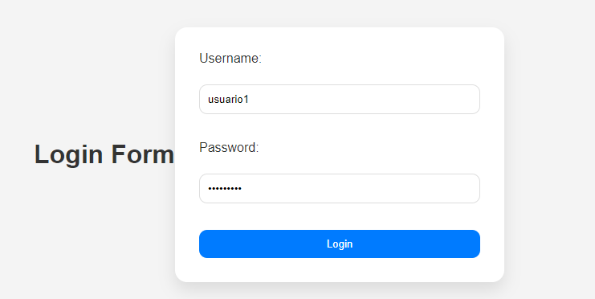
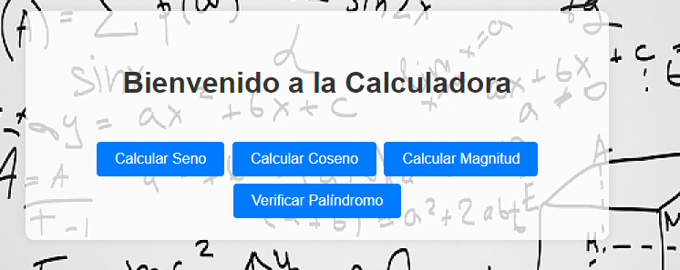
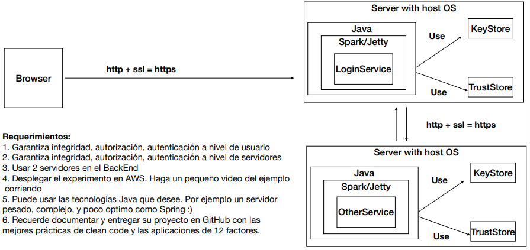

# AREP - Taller 7

## Descripción

El laboratorio se basa en la comunicación segura entre el cliente y el servidor, y entre 2 servidores.
Para ello, se hace uso de un cetificado SSL para garantizar la seguridad de la información con HTTPS.
La aplicación consta de un servicio de login y una calculadora, donde el servicio de login se encarga 
de manejar la autenticación de los usuarios y de redirigir las peticiones a los servicios correspondientes.
La parte del back se ejecutará en dos servidores de dos máquinas EC2 de AWS diferentes, 
uno para el servicio de login y otro para la calculadora.

## Comenzando

Las siguientes instrucciones le permitirán obtener una copia del proyecto en funcionamiento en su máquina local para fines de desarrollo y prueba.

### Requisitos

- [Git](https://www.youtube.com/watch?v=4xqVv2lTo40/) - Control de versiones
- [Maven](https://www.youtube.com/watch?v=1QfiyR_PWxU) - Gestor de dependencias
- [Java 17](https://www.youtube.com/watch?v=BG2OSaxWX4E) - Lenguaje de programación

### Instalación

Para hacer una copia local del proyecto, debemos abrir nuestra terminal, dirigirnos al directorio donde estará el proyecto y usar el siguiente comando

```bash
git clone https://github.com/andreaduranvivas/AREP-Taller7
```

Nos dirigimos al directorio creado con

```bash
cd AREP-Taller7
```


## Ejecutando la aplicación

Para ejecutar la aplicación, primero debemos compilar el proyecto con el siguiente comando `mvn clean install`
. Esto nos permitirá limpiar las construcciones previas de otras versiones y luego compilará el proyecto.

Para ejecutar el proyecto se debe ejecutar el siguiente comando:

Abrimos una terminal y ejecutamos el siguiente comando:
```
mvn exec:java '-Dexec.mainClass=edu.arep.login.Login'
```

Abrimos otra terminal y ejecutamos el siguiente comando:
```
mvn exec:java '-Dexec.mainClass=edu.arep.funciones.Calculadora'
```

Para visualizar la aplicación, escogemos algún navegador e ingresamos la URL http://localhost:5000/ en la barra de direcciones. Allí encontraremos la página principal de la aplicación,
la cual se basa en un formulario que nos permite ingresar un usuario y una contraseña para poder acceder a la calculadora.
(Un usuario válido es: 'usuario1' y la contraseña es: 'contraseña1').



Después podemos ver la página de la calculadora, donde encontraremos 4 botones que nos redirigirán a las páginas de seno, coseno, magnitud y palíndromo. Podemos escoger cualquiera de ellas y
ver el resultado de la operación.



A continuación se presenta un video demostrando el funcionamiento de la aplicación, haciendo uso de una instancia de EC2 en AWS.
En este caso, lo único que cambiamos es la URL, ya que ya no sería localhost, sino el DNS de la IPv4 pública de nuestra VM.
Cabe recordar que se deben agregar las reglas de entrada a la instancia para poder ejecutar la aplicación, se deben abrir los puertos
5000 y 4567.

[](https://youtu.be/AINZ3AHpHRU)


## Pruebas

Se realizaron pruebas unitarias y pruebas de integración.
Las pruebas unitarias están enfocadas al funcionamiento del servicio de login,
puesto que en laboratorios pasados se verificó el funcionamiento de la calculadora.
Estas se pueden ejecutar al correr este comando`mvn test`

## Documentación

Para visualizar la documentación del proyecto solo debes correr el siguiente comando desde el directorio raiz del proyecto

```bash
mvn javadoc:javadoc
```

Y en la siguiente ruta encontrarás el archivo index.html en donde si lo abres desde el navegador podras ver toda la documentación

```
./target/site/apidocs
```

## Arquitectura de la aplicación

La arquitectura del prototipo consta de los siguientes componentes:

- **Login:** Se encarga de manejar la autenticación de los usuarios y de redirigir las peticiones a los servicios correspondientes.
Recibe peticiones seguras (HTTPS) y su puerto es el 5000. Usa servicios REST para redirigir peticiones POST a la ruta `/login `.
En caso de que el usuario esté registrado, redirige a la página de la calculadora usando el componente `URLReader` que usa llaves generadas 
para garantizar la seguridad.


- **Calculadora:** Se trata de una aplicación que tiene 4 páginas para hacer operaciones (seno, coseno, magnitud y palíndromo).
Recibe peticiones HTTPS y su puerto es el 4567. Usa servicios REST para redirigir peticiones GET a las rutas 
`/sin`, `/cos`, `/magnitude` y `/palindrome`.


A continuación se ve el diagrama de la arquitectura



## Autores

- **Andrea Durán** - [Usuario en GitHub](https://github.com/andreaduranvivas)

## Construido con

* [Spark Framework](https://sparkjava.com/) - Java/Kotlin web framework
* [Maven](https://maven.apache.org/) - Dependency Management
* [Java](https://www.java.com/es/) - Programming Language
* [JavaScript](https://developer.mozilla.org/en-US/docs/Web/javascript) - Programming Language
* [CSS](https://www.w3.org/Style/CSS/Overview.en.html) - stylesheet Language
* [HTML](https://html.com/) - HyperText Markup Language


## Versiones


## Licencia

Este proyecto está bajo la licencia MIT. Ver el archivo [LICENSE](LICENSE) para más detalles.

## Agradecimientos

- Al profesor [Luis Daniel Benavides Navarro](https://ldbn.is.escuelaing.edu.co/)